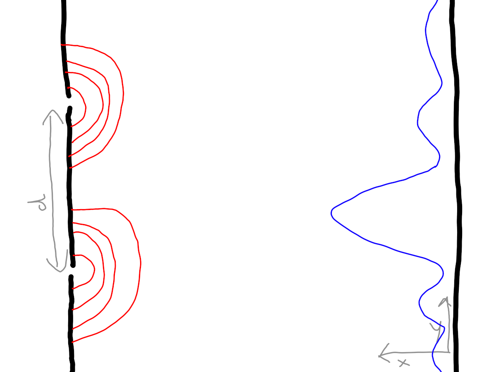

# doubleslit

The douple slit experiment is very interesing: particles from a particle source are blocked and can only pass through a double slit. Behind the double slit is a screen that detects the particles. Intuitively we think a particle goes either through the left or the right slit, but what one finds is an intereference patterns that can only be explained if the particle is a wave and passes through both slits. This is the famous [particle-wave duality](https://en.wikipedia.org/wiki/Wave%E2%80%93particle_duality)



Go code that visualizes the double slit experiment

Intensity of fringes in Young's double slit experiment:

$$
I = I_{max} cos^2(\frac{\pi d sin \theta}{\lambda})
$$ 

where $I_{max}$ is the maximum intensity, $d$ is the distance of the center of the two slits, $\theta$ is the diffraction angle $\lambda$ is the wavelength. We can use

```math
\begin{aligned}
 x &= x_0 sin(\alpha)\\  
 y &= y_0 cos(\alpha)
 \end{aligned}
```